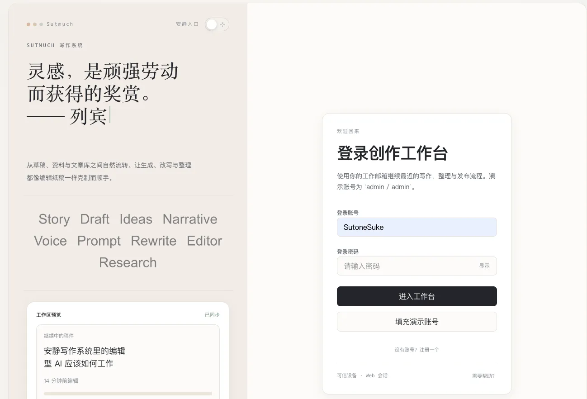
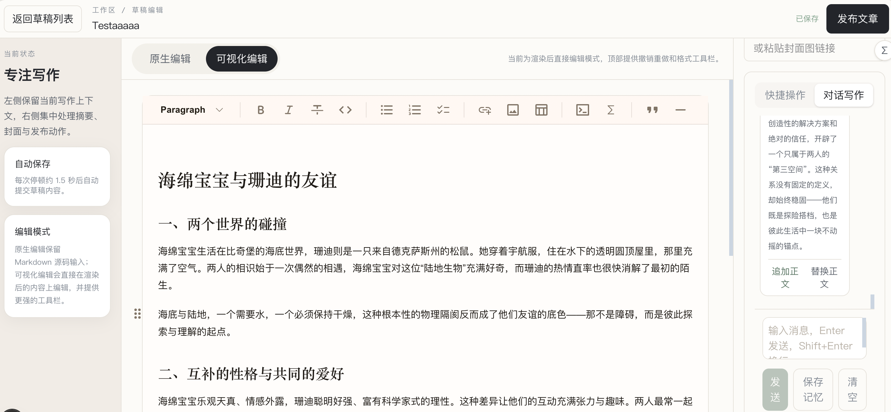
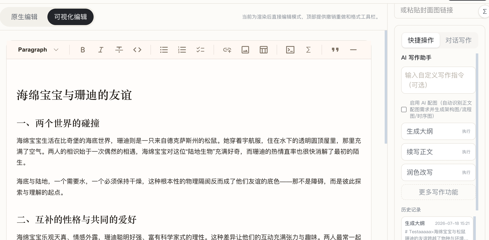
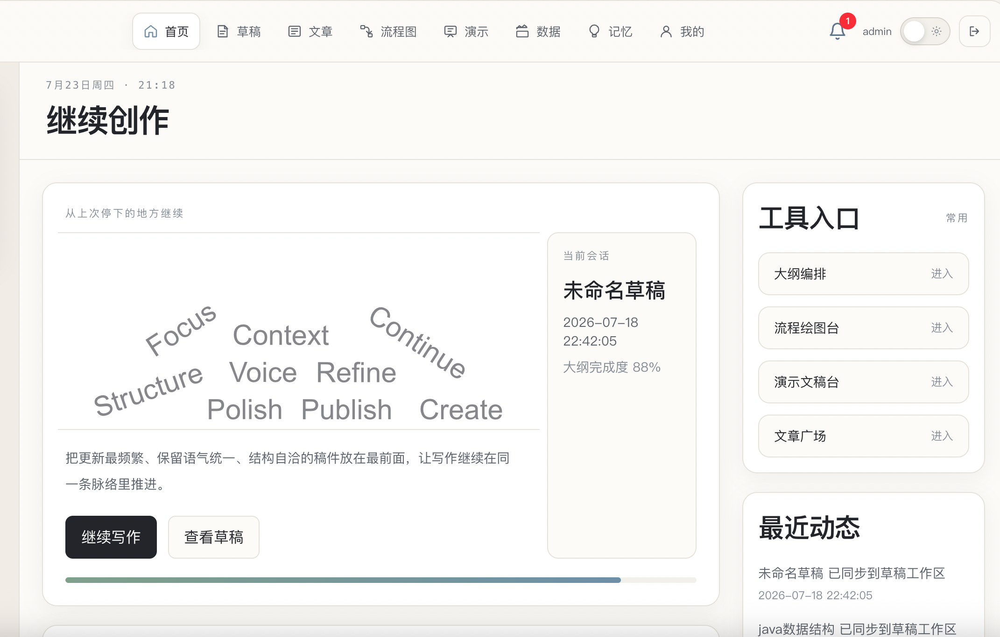
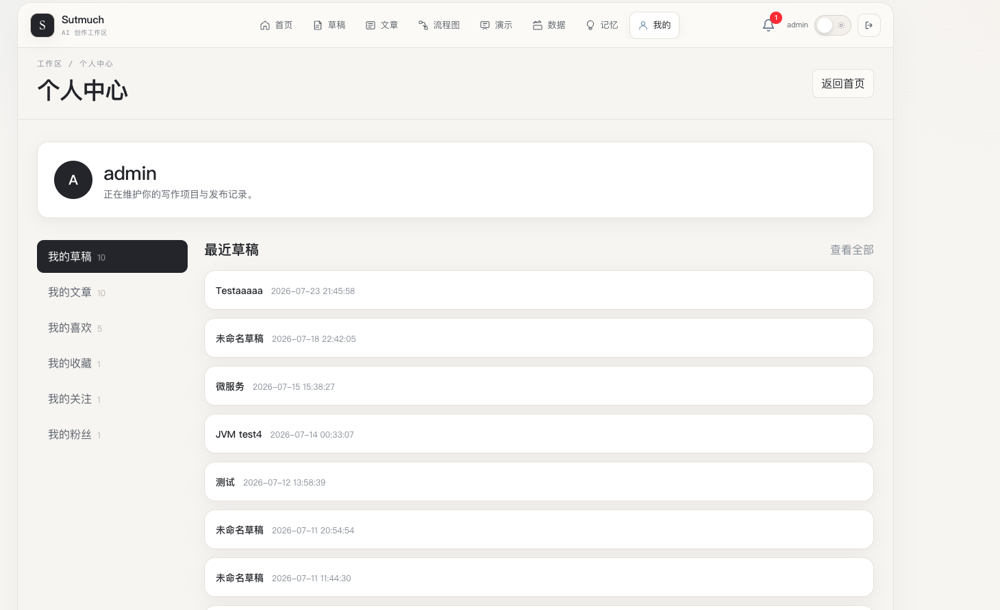
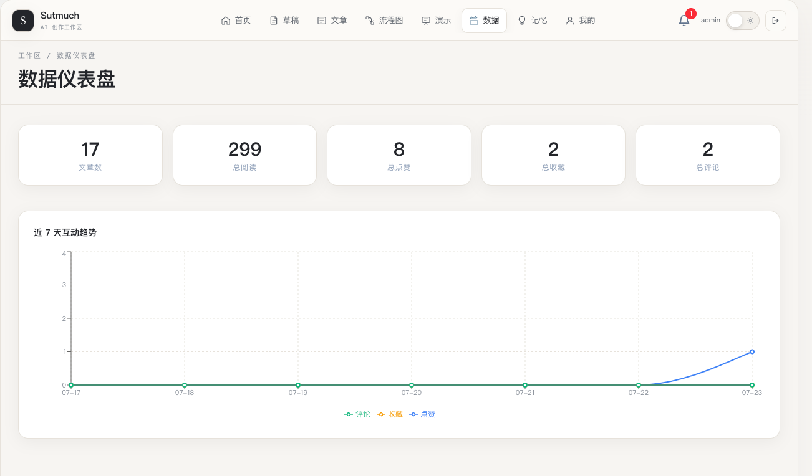
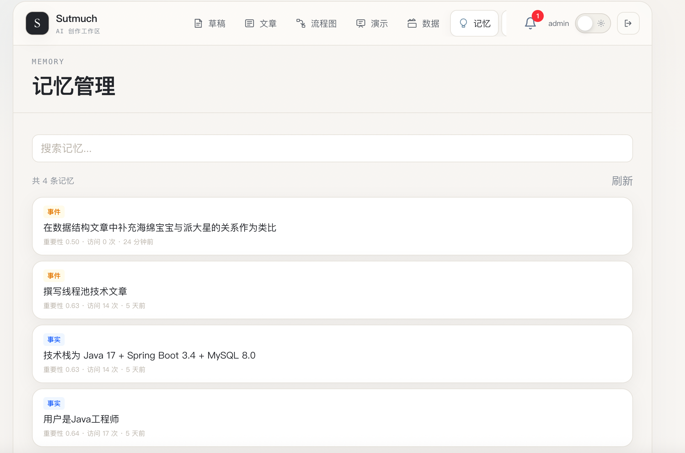
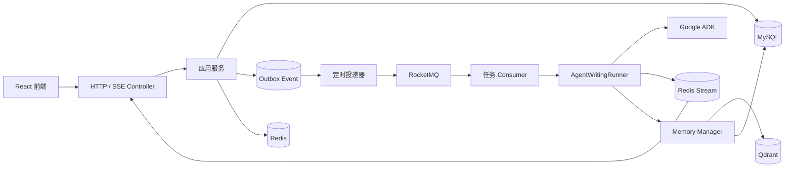

# Sutmuch AgentWrite

> 面向技术创作者的多智能体个性化创作工作台。
>
> 本项目是一个以 Java 为后端、Google ADK 为 Agent 编排核心的个人项目，围绕“草稿输入 → Agent 协作 → 流式输出 → 结果落库 → 用户记忆沉淀”构建完整的 AI 写作链路。本仓库只包含项目后端代码，前端代码位于 /hhhhaaaaaad/sutone-agent-bok-front 仓库中

[](https://www.oracle.com/java/technologies/javase/jdk17-archive-downloads.html)
[](https://spring.io/projects/spring-boot)
[](https://github.com/google/adk-java)
[](https://rocketmq.apache.org/)

## 快速导航

- [项目定位](#项目定位)
- [核心能力](#核心能力)
- [系统架构](#系统架构)
- [模块结构](#模块结构)
- [本地运行](#本地运行)
- [测试](#测试)

## 技术栈

| 领域 | 技术 |
| --- | --- |
| 后端基础 | Java 17、Spring Boot 3.4.3、Maven |
| Agent | Google ADK 0.5.0、Spring AI、MCP、RxJava |
| 数据存储 | MySQL、Redis / Redisson、Qdrant |
| 异步与流式 | RocketMQ、Redis Stream、SSE |
| 数据访问 | MyBatis、HikariCP |
| 部署与环境 | Docker、Docker Compose |

## 项目定位

Sutmuch AgentWrite 不是简单的聊天式文本生成工具，而是一个面向技术写作场景的 Agent 应用。用户输入或编辑文章草稿后，系统可以根据任务类型完成续写、扩写、润色、摘要、标题生成、标签生成、质量检查和智能配图等操作。

项目重点关注以下工程问题：

- 如何将模型、Prompt、工具和 Agent 工作流进行配置化装配；
- 如何处理多 Agent 长任务中的事件流、阶段状态和增量内容；
- 如何将用户技术背景与写作偏好沉淀为可检索记忆；
- 如何通过消息队列将耗时较长的 Agent 执行从 HTTP 请求线程中解耦；
- 如何使用 Redis、MySQL、Qdrant 和 RocketMQ 支撑写作工作台及社区基础能力。

> 当前仓库主要包含后端多模块工程。React 前端未纳入本仓库，后端接口可通过 HTTP、SSE 和任务状态查询接口接入前端。

## UI 页面展示
### 1. 登录（左侧随机动态名言）：


### 2. 对话写作


### 3.快捷操作（无需对话历史）


### 4.首页


### 5. 个人中心


### 6. 数据流量


### 7. 记忆可视化管理界面


## 核心能力

### 1. 配置驱动的 Agent 装配

基于 Google ADK 构建 Agent 装配层，将 Agent、模型、Prompt、MCP 工具和工作流放入 YAML 配置中，在应用启动阶段完成装配。

目前已配置的写作相关 Agent 包括：

- 需求分析 Agent：分析草稿上下文和写作任务；
- 内容生成 Agent：完成续写、扩写、润色等内容生成；
- 质量审校 Agent：检查结构、表达、代码和技术准确性；
- 配图分析 Agent：识别适合添加架构图、流程图或时序图的位置；
- Draw.io Agent：根据配图需求生成 draw.io XML；
- MCP 工具：为 Agent 提供外部搜索等工具能力。

相关实现：

- [Agent 自动装配](sutone-agent-bok-app/src/main/java/cn/sutone/ai/config/AiAgentAutoConfig.java)
- [写作 Agent 配置](sutone-agent-bok-app/src/main/resources/agent/agent-writing.yml)
- [Draw.io Agent 配置](sutone-agent-bok-app/src/main/resources/agent/agent-draw-io.yml)
- [Agent 工作流运行器](sutone-agent-bok-domain/src/main/java/cn/sutone/ai/domain/agent/service/ai_writing/AgentWritingRunner.java)

### 2. 流式写作与内容治理

Agent 事件通过响应式流进行消费，并根据事件来源进行阶段化处理：

- 分析阶段：向前端推送当前任务阶段和进度状态；
- 生成阶段：通过 SSE 增量推送正文内容；
- 审校阶段：缓冲结构化结果后统一处理和落库；
- 配图阶段：解析配图需求，调用 Draw.io Agent 生成 XML 并回插文章内容；
- Markdown 治理：通过规则归一化与 CommonMark AST 渲染，修复代码块 fence、列表缩进等格式问题。

相关实现：

- [AI 写作服务](sutone-agent-bok-domain/src/main/java/cn/sutone/ai/domain/agent/service/ai_writing/AiWritingService.java)
- [Markdown 归一化](sutone-agent-bok-domain/src/main/java/cn/sutone/ai/domain/agent/service/ai_writing/markdown/MarkdownNormalizer.java)
- [Markdown 块渲染](sutone-agent-bok-domain/src/main/java/cn/sutone/ai/domain/agent/service/ai_writing/markdown/MarkdownBlockRenderer.java)
- [SSE 与任务接口](sutone-agent-bok-trigger/src/main/java/cn/sutone/ai/trigger/http/AiWritingController.java)

### 3. 用户记忆与混合检索

记忆系统参考 Mem0 的设计思路独立实现，用于沉淀用户的技术背景、熟悉的技术栈和写作偏好。

写入链路：

```text
会话消息
   ↓
LLM 抽取候选记忆
   ↓
内容哈希去重 + 向量相似度去重
   ↓
MySQL 保存记忆记录
   ↓
Embedding 后写入 Qdrant
```

检索链路：

```text
当前草稿 / 用户问题
   ├── Qdrant 向量召回
   └── BM25 关键词召回
            ↓
      混合结果合并
            ↓
       Reranker 精排
            ↓
      Top-K 记忆注入 Prompt
```

相关实现：

- [记忆管理主流程](sutone-agent-bok-domain/src/main/java/cn/sutone/ai/domain/agent/service/memory/MemoryManager.java)
- [记忆检索](sutone-agent-bok-domain/src/main/java/cn/sutone/ai/domain/agent/service/memory/MemoryRetriever.java)
- [记忆抽取](sutone-agent-bok-domain/src/main/java/cn/sutone/ai/domain/agent/service/memory/MemoryExtractor.java)
- [Qdrant 向量存储](sutone-agent-bok-infrastructure/src/main/java/cn/sutone/ai/infrastructure/adapter/repository/QdrantVectorStore.java)
- [Reranker 客户端](sutone-agent-bok-infrastructure/src/main/java/cn/sutone/ai/infrastructure/adapter/repository/RerankerClient.java)

### 4. 长任务异步执行

多 Agent 写作、审校和配图涉及多次模型调用，执行时间不可预测。若直接占用 HTTP 请求线程，容易造成请求超时，也无法很好地处理客户端断开后的任务状态。因此项目将任务提交与 Agent 执行拆分：

```text
前端提交写作任务
        ↓
MySQL 同事务保存 AiTask + OutboxEvent
        ↓
接口返回 taskId
        ↓
Outbox 定时投递 RocketMQ
        ↓
Consumer 条件更新原子抢占任务
        ↓
独立执行 Agent 工作流
        ↓
Redis Stream 保存生成事件
        ↓
SSE 实时推送 / 按事件 ID 回放
```

设计要点：

- Transactional Outbox：任务记录和待投递事件在同一事务中落库；
- RocketMQ：解耦 HTTP 任务提交与耗时较长的 Agent 执行；
- 条件更新抢占：避免多个 Consumer 同时执行同一任务；
- Redis Stream：保存任务生成事件，支持实时消费和已产生事件回放；
- 任务状态：统一维护 PENDING、RUNNING、RETRYING、SUCCESS、FAILED 等状态。

相关实现：

- [任务提交与执行](sutone-agent-bok-domain/src/main/java/cn/sutone/ai/domain/agent/service/ai_writing/AiWritingService.java)
- [Outbox 投递任务](sutone-agent-bok-trigger/src/main/java/cn/sutone/ai/trigger/job/AiTaskOutboxPublisher.java)
- [RocketMQ Consumer](sutone-agent-bok-trigger/src/main/java/cn/sutone/ai/trigger/listener/AiTaskConsumer.java)
- [Redis Stream 事件发布](sutone-agent-bok-infrastructure/src/main/java/cn/sutone/ai/infrastructure/redis/TaskEventPublisher.java)

### 5. Redis 与社区基础能力

- Redisson 令牌桶：限制用户 AI 接口调用频率；
- 文章缓存：使用 Cache-Aside、空值缓存、随机过期和互斥重建处理缓存问题；
- 互动数据：使用 Redis Set 支持点赞、关注等关系去重；
- 热度排序：使用 Redis Sorted Set 支持文章热榜排序；
- 分布式协作：通过 Redis 锁降低同一草稿任务的重复提交。

相关实现：

- [AI 接口限流](sutone-agent-bok-domain/src/main/java/cn/sutone/ai/domain/agent/service/ratelimit/RateLimitService.java)
- [文章缓存](sutone-agent-bok-domain/src/main/java/cn/sutone/ai/domain/content/service/cache/ArticleCacheService.java)
- [社区服务](sutone-agent-bok-domain/src/main/java/cn/sutone/ai/domain/content/service/social/SocialService.java)

## 系统架构



## 模块结构

```text
sutone-agent-bok
├── sutone-agent-bok-api              # 对外 API 接口、DTO 和响应对象
├── sutone-agent-bok-types            # 通用枚举、异常、DTO 和基础类型
├── sutone-agent-bok-domain           # 领域实体、领域服务、仓储接口和 Agent 业务逻辑
├── sutone-agent-bok-infrastructure   # MySQL、Redis、Qdrant、外部服务等基础设施适配
├── sutone-agent-bok-trigger          # HTTP、SSE、RocketMQ Consumer、定时任务等触发器
└── sutone-agent-bok-app              # Spring Boot 启动模块和配置装配
```

后端采用 DDD 风格分层，将领域逻辑与 MySQL、Redis、Qdrant、RocketMQ 等基础设施适配代码隔离。`trigger` 模块负责外部请求与消息触发，`app` 模块负责应用启动和配置装配。

## 本地运行

### 环境要求

- JDK 17+
- Maven 3.8+
- Docker 20+
- Docker Compose v2+
- 可用的模型 API Key
- 可用的 Embedding API Key

根项目当前 Maven 配置的编译版本为 Java 17，Google ADK 版本为 0.5.0。

### 1. 启动基础设施

在项目根目录执行：

```bash
cd docs/dev-ops
docker compose -f docker-compose-environment.yml up -d
```

该 Compose 文件会启动：

| 服务 | 本地端口 | 用途 |
| --- | ---: | --- |
| MySQL | `13306` | 业务数据、任务数据和记忆记录 |
| Redis | `16379` | 缓存、限流、分布式锁和 Stream |
| RocketMQ NameServer | `9876` | 消息路由 |
| RocketMQ Broker | `10911` | 任务消息投递 |
| Qdrant | `6333` | 记忆向量存储 |

### 2. 配置模型服务密钥

返回项目根目录，在启动应用前设置环境变量：

```bash
cd ../..
export MEMORY_EMBEDDING_API_KEY="your_embedding_api_key"
export SUTONE_WRITING_MODEL_API_KEY="your_writing_model_api_key"

# 使用 Draw.io 配图能力时配置
export SUTONE_DRAWIO_MODEL_API_KEY="your_drawio_model_api_key"
```

密钥只通过环境变量注入，不要将真实密钥写入 YAML、README 或提交到 Git。主要配置入口为：

- [通用应用配置](sutone-agent-bok-app/src/main/resources/application.yml)
- [本地 Docker 依赖配置](sutone-agent-bok-app/src/main/resources/application-docker-local.yml)
- [写作 Agent 配置](sutone-agent-bok-app/src/main/resources/agent/agent-writing.yml)
- [记忆系统配置](sutone-agent-bok-app/src/main/resources/application-docker-local.yml)

### 3. 编译和启动后端

```bash
mvn -pl sutone-agent-bok-app -am clean package -Dmaven.test.skip=true
java -jar sutone-agent-bok-app/target/sutone-agent-bok-app.jar
```

也可以直接使用 Maven 启动：

```bash
mvn -pl sutone-agent-bok-app -am spring-boot:run -Dmaven.test.skip=true
```

应用默认端口为 `8091`，默认配置文件使用 `docker-local` Profile：

```text
http://localhost:8091
```

### 4. 停止基础设施

```bash
cd docs/dev-ops
docker compose -f docker-compose-environment.yml down
```

如需同时删除 MySQL 和 Qdrant 数据卷，请先确认本地数据不再需要，再执行：

```bash
docker compose -f docker-compose-environment.yml down -v
```

## 测试

项目包含 Agent 编排、Markdown 处理、记忆检索和基础 API 等测试代码，测试目录位于：

```text
sutone-agent-bok-app/src/test
```

其中部分 Agent 和外部模型相关测试需要配置对应的 API Key，并可能产生外部 API 调用。首次验证项目时，建议先执行上方已验证的编译命令，确认模块依赖和生产代码构建正常，再根据测试类的依赖配置运行对应测试。


## 当前状态与后续计划

当前仓库已完成 Agent 配置装配、写作任务执行、用户记忆、Redis 基础能力、RocketMQ 长任务解耦和社区基础模块。项目仍在持续迭代，外部模型服务、前端工程和部分生产级运维能力需要根据实际部署环境补充配置。

后续计划包括：

- 增加 Agent 工作流的自动化评测集和质量指标；
- 增加任务链路 Trace、模型调用耗时和 Token 消耗监控；
- 完善 Outbox 投递重试、任务恢复和消费幂等测试；
- 补充部署文档和接口示例。

## 目录说明

- [后端模块](sutone-agent-bok-app)
- [数据库初始化脚本](docs/dev-ops/mysql/sql)
- [Docker Compose 环境](docs/dev-ops)
- [Agent 配置](sutone-agent-bok-app/src/main/resources/agent)

## License

当前仓库尚未单独添加开源许可证。代码主要用于个人学习、技术实践和求职项目展示，使用或二次分发前请联系作者确认。
